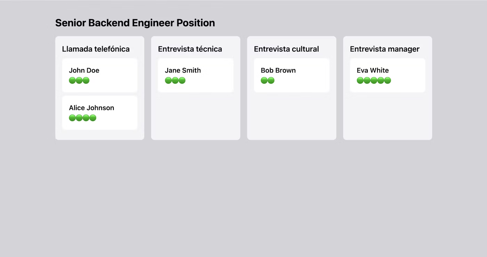

# Prompt 1



Eres un experto desarrollador de software en frontend con React

A partir de la siguiente imagen, necesito generar un componente de React en la carpeta@components , que me permita hacer lo siguiente:

- Se debe mostrar el título de la posición en la parte superior, para dar contexto
- Añadir una flecha a la izquierda del título que permita volver al listado de posiciones
- Deben mostrarse tantas columnas como fases haya en el proceso
- La tarjeta de cada candidato/a debe situarse en la fase correspondiente, y debe mostrar su nombre completo y su puntuación media
- Si es posible, debe mostrarse adecuadamente en móvil (las fases en vertical ocupando todo el ancho)

Recuerda que la parte superior, que va arriba de las cards es el título de la posición

Cada card, dentro de ella, tiene el título de la fase

Y debajo de este título de fase, hay unas pequeñas cards que me muestran el nombre del candidato y debajo del nombre del candidato, la puntuación que tiene el candidato con círculos verdes

Aún no generes código, hazme las preguntas que necesites para completar la petición, solo explícame qué vas a hacer

## Respuesta

Para completar tu petición, voy a crear un nuevo componente en la carpeta components que cumpla con los siguientes requisitos:

- Título de la posición: Mostrar el título de la posición en la parte superior.
- Flecha de regreso: Añadir una flecha a la izquierda del título para volver al listado de posiciones.
- Columnas por fases: Mostrar tantas columnas como fases haya en el proceso.
- Tarjetas de candidatos: Situar la tarjeta de cada candidato en la fase correspondiente, mostrando su nombre completo y su puntuación media.
- Responsividad: Asegurar que se muestre adecuadamente en dispositivos móviles (fases en vertical ocupando todo el ancho).

Preguntas:

1. ¿Cómo obtengo los datos de las fases y los candidatos? ¿Hay algn endpoint específico?
2. ¿Tienes algn diseño o estilo específico que deba seguir para las tarjetas y columnas?
3. ¿Debo usar algn ícono específico para la flecha de regreso?
4. ¿Hay algún límite en el número de fases o candidatos que deba considerar para la responsividad?

Con esta información, podré proceder a generar el código necesario.

# Prompt 2

1. Para las fases, puedes usar el siguiente endpoint: GET /position/:id/interviewFlow

Este endpoint devuelve información sobre el proceso de contratación para una determinada posición:

- positionName: Título de la posición
- interviewSteps: id y nombre de las diferentes fases de las que consta el proceso de contratación

Ejemplo de respuesta:

```
{
     "positionName": "Senior backend engineer",
     "interviewFlow": {

             "id": 1,
             "description": "Standard development interview process",
             "interviewSteps": [
                 {
                     "id": 1,
                     "interviewFlowId": 1,
                     "interviewTypeId": 1,
                     "name": "Initial Screening",
                     "orderIndex": 1
                 },
                 {
                     "id": 2,
                     "interviewFlowId": 1,
                     "interviewTypeId": 2,
                     "name": "Technical Interview",
                     "orderIndex": 2
                 },
                 {
                     "id": 3,
                     "interviewFlowId": 1,
                     "interviewTypeId": 3,
                     "name": "Manager Interview",
                     "orderIndex": 2
                 }
             ]
         }
 }
```

Para los candidatos puedes usar el siguiente endpoint: GET /position/:id/candidates

Este endpoint devuelve todos los candidatos en proceso para una determinada posición, es decir, todas las aplicaciones para un determinado positionID. Proporciona la siguiente información:

- name: Nombre completo del candidato
- current_interview_step: en qué fase del proceso está el candidato.
- score: La puntuación media del candidato

Ejemplo de respuesta:

```JSON
[
     {
          "fullName": "Jane Smith",
          "currentInterviewStep": "Technical Interview",
          "averageScore": 4
      },
      {
          "fullName": "Carlos García",
          "currentInterviewStep": "Initial Screening",
          "averageScore": 0
      },
      {
          "fullName": "John Doe",
          "currentInterviewStep": "Manager Interview",
          "averageScore": 5
     }
]
```

2. Puedes usar el de la imagen?

3. Recomiéndame uno

4. 10

# Prompt 3

Para position y candidates, podrías generar archivos de interfaces?

# Prompt 4

Veo que el diseño no cumple con el de la imagen, faltan agregar los colores de fondo de todos los elementos, y modificar los score, cambiando los números por círculos verdes, es decir, si el score es 4, deberían salir 4 círculos verdes y deberían estar debajo del nombre del candidato, puedes usar el caracter ascii de círculo verde, podrías agregar los estilos correspondientes?

# Prompt 5

Ahora, necesito que las cards de los candidatos se puedan mover entre fases arrastrando y soltando entre fases. cada vez que se mueva una tarjeta de fase debería ejecutarse el siguiente endpoint: PUT /candidate/:id

Este endpoint actualiza la etapa del candidato movido. Permite modificar la fase actual del proceso de entrevista en la que se encuentra un candidato específico, a través del parámetro "new_interview_step" y proporionando el interview_step_id correspondiente a la columna en la cual se encuentra ahora el candidato.

Ejemplo de body:

```
{
    "applicationId": "1",
    "currentInterviewStep": "3"
}
```

Ejemplo de respuesta:

```
{
   "message": "Candidate stage updated successfully",
    "data": {
        "id": 1,
        "positionId": 1,
        "candidateId": 1,
        "applicationDate": "2024-06-04T13:34:58.304Z",
        "currentInterviewStep": 3,
        "notes": null,
        "interviews": []
    }
}
```

No generes código, hzme las preguntas necesarias y explícame qué harás

## Respuesta

Para implementar la funcionalidad de arrastrar y soltar entre fases y actualizar la etapa del candidato, seguiré estos pasos:

1. Instalar React DnD: Utilizaré la biblioteca react-dnd para manejar el arrastre y soltado.
2. Modificar el componente PositionDetails: Integrar react-dnd para permitir el arrastre y soltado de las tarjetas de candidatos.
3. Actualizar el estado y llamar al endpoint: Al soltar una tarjeta en una nueva fase, actualizaré el estado y llamaré al endpoint PUT /candidate/:id.

### Preguntas:

1. ¿Debo manejar algún tipo de autenticación o token para las solicitudes PUT?
2. ¿Hay algún límite en el número de fases o candidatos que deba considerar para la responsividad?
3. ¿Debo mostrar algún mensaje de éxito o error al actualizar la fase del candidato?

# Prompt 6

1. Ninguno

2. 10, pero esto ya lo hiciste antes

3. Sí, muestra un mensaje

# Prompt 7

Cómo puedo solucionar el siguiente error?

Expected drag drop context
Invariant Violation: Expected drag drop context
at invariant (http://localhost:3000/static/js/bundle.js:91416:15)
at useDragDropManager (http://localhost:3000/static/js/bundle.js:91588:66)
at useDropTargetMonitor (http://localhost:3000/static/js/bundle.js:92076:93)
at useDrop (http://localhost:3000/static/js/bundle.js:91993:97)
at InterviewStepColumn (http://localhost:3000/static/js/bundle.js:1055:69)
at renderWithHooks (http://localhost:3000/static/js/bundle.js:59095:22)
at mountIndeterminateComponent (http://localhost:3000/static/js/bundle.js:63066:17)
at beginWork (http://localhost:3000/static/js/bundle.js:64369:20)
at HTMLUnknownElement.callCallback (http://localhost:3000/static/js/bundle.js:49351:18)
at Object.invokeGuardedCallbackDev (http://localhost:3000/static/js/bundle.js:49395:20)

# Prompt 8

Podrias pasar los llamados a los endpoint del backend en el archivo @PositionDetails.tsx a un archivo de servicio manteniendo la lógica usada?

# Prompt 9

Podrías hacer que el botón de "Ver Proceso" en @Positions.tsx redirija a @PositionDetails.tsx ?
